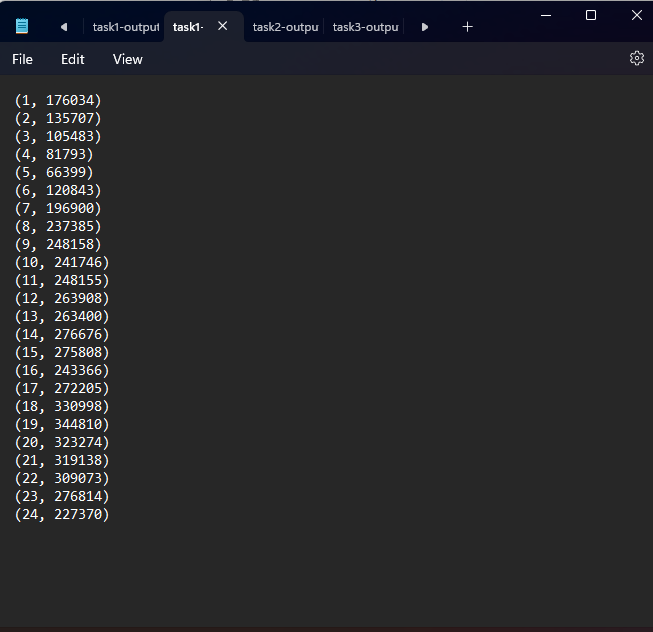
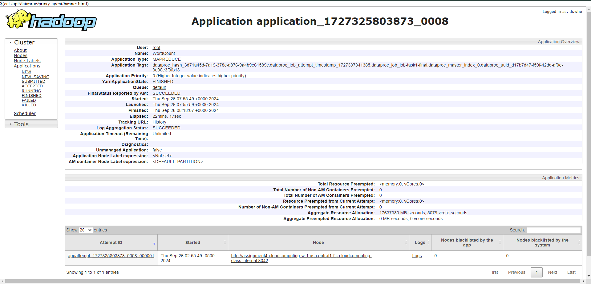
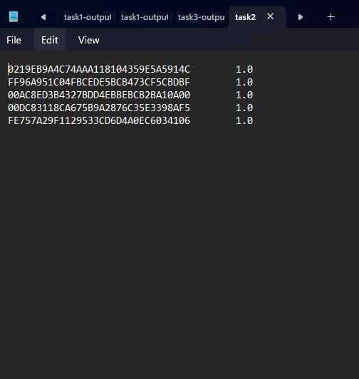
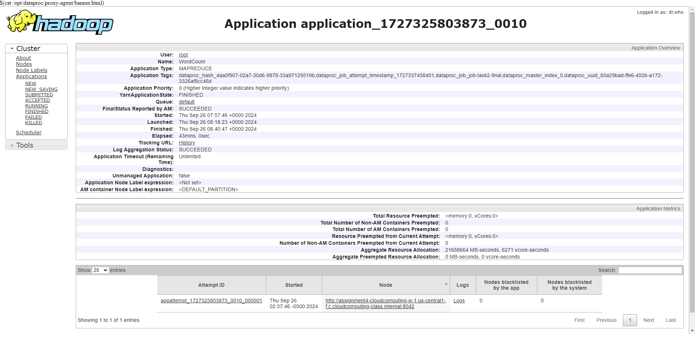
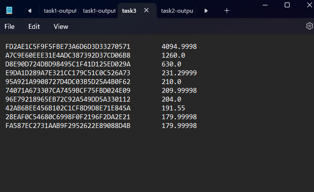
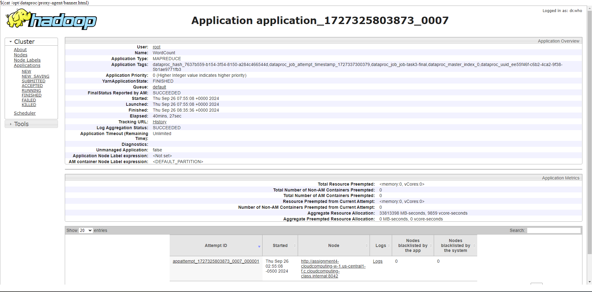
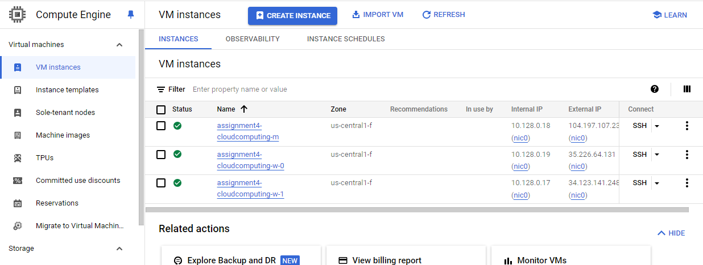
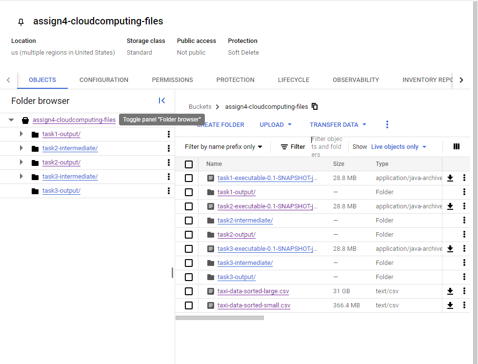

# Please add your team members' names here. 

## Team members' names 

1. Student Name: Abhinav Kolli

   Student UT EID: ark3457

2. Student Name: Aryan Samal

   Student UT EID: as225468

3. Student Name: Nishitha Vattikonda

   Student UT EID: nv6462

##  Course Name: CS378 - Cloud Computing 

##  Unique Number: 51515
    


# Project Report

## Results and YARN for each task

### Task 1 - Errors in GPS Position Records (5 points)





### Task 2 - Identifying the Five Taxis with the Highest GPS Error Rates (10 points)





### Task 3 - Identifying the Ten Most Efficient Drivers in Terms of Earnings per Minute (5 points)





## Proof from Google Cloud






# Project Template

# Running on Laptop     ####

Prerequisite:

- Maven 3

- JDK 1.6 or higher

- (If working with eclipse) Eclipse with m2eclipse plugin installed


The java main class is:

edu.cs.utexas.HadoopEx.WordCount 

Input file:  Book-Tiny.txt  

Specify your own Output directory like 

# Running:


## Create a JAR Using Maven 

To compile the project and create a single jar file with all dependencies: 
	
```	mvn clean package ```


## Run your application
Inside your shell with Hadoop

Running as Java Application:

```java -jar target/MapReduce-WordCount-example-0.1-SNAPSHOT-jar-with-dependencies.jar SOME-Text-Fiel.txt  output``` 

Or has hadoop application

```hadoop jar your-hadoop-application.jar edu.cs.utexas.HadoopEx.WordCount arg0 arg1 ... ```


## Create a single JAR File from eclipse


Create a single gar file with eclipse 

*  File export -> export  -> export as binary ->  "Extract generated libraries into generated JAR"
